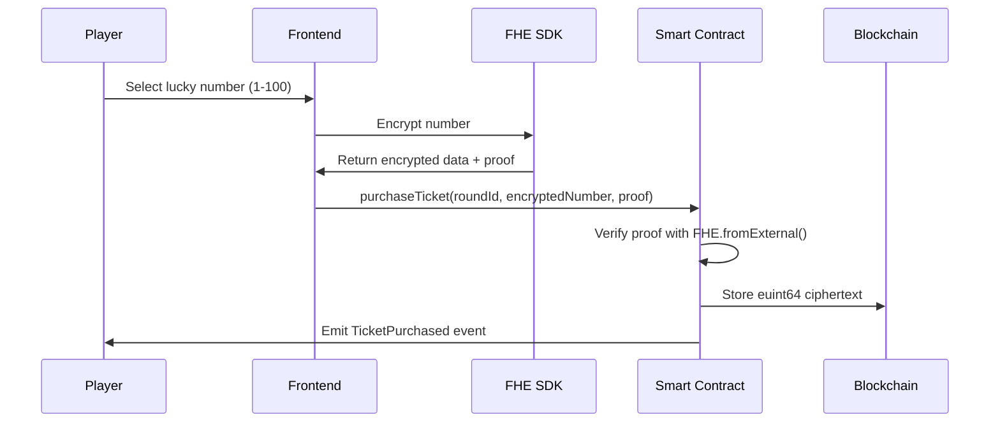
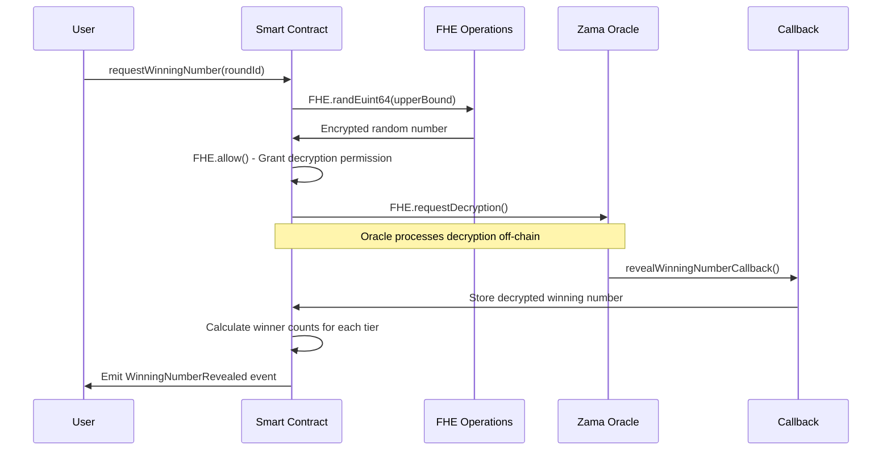

# Tempest Lottery 🎰

[](https://opensource.org/licenses/MIT)
[](https://docs.zama.ai/fhevm)
[](https://sepolia.etherscan.io)

**Tempest Lottery** is a revolutionary fully encrypted on-chain lottery game powered by Zama's Fully Homomorphic Encryption (FHE) technology. It ensures complete privacy of player selections while maintaining transparency and fairness in the drawing process.

## 🌟 Live Demo

🔗 **[https://tempestgoalgrid-ql6eh14we-songsus-projects.vercel.app](https://tempestgoalgrid-ql6eh14we-songsus-projects.vercel.app)**

## 📋 Table of Contents

- [Overview](#overview)
- [Core Features](#core-features)
- [Game Mechanics](#game-mechanics)
- [FHE Technology](#fhe-technology)
- [Architecture](#architecture)
- [Smart Contract](#smart-contract)
- [Frontend](#frontend)
- [Testing](#testing)
- [Development](#development)
- [Deployment](#deployment)
- [License](#license)

## 🎯 Overview

Tempest Lottery revolutionizes traditional lottery systems by leveraging Zama's fhEVM (Fully Homomorphic Encryption for Ethereum Virtual Machine) to create a completely private yet verifiable lottery experience. Unlike conventional lotteries where selections are publicly visible on-chain, Tempest Lottery encrypts all player numbers using FHE, ensuring:

- **Privacy**: Player numbers remain encrypted on-chain and cannot be viewed by anyone
- **Fairness**: Winning number generated using cryptographically secure FHE random generation
- **Transparency**: All operations are verifiable on the blockchain
- **Trustless**: No centralized authority controls the outcome

## ✨ Core Features

### 🔐 End-to-End Encryption
- Player numbers encrypted client-side using Zama RelayerSDK
- Numbers stored as `euint64` ciphertext on-chain
- Privacy preserved throughout entire lottery lifecycle

### 🎲 Provably Fair Random Generation
- Winning numbers generated using `FHE.randEuint64()`
- Cryptographically secure FHE random number generation
- Oracle-based decryption ensures verifiable randomness

### 💰 Three-Tier Prize System
- **Tier 1 (Jackpot)**: Exact match - 50% of prize pool
- **Tier 2 (Silver)**: Within ±5 - 30% of prize pool
- **Tier 3 (Bronze)**: Within ±10 - 20% of prize pool

### ⚡ Decentralized & Permissionless
- Anyone can create lottery rounds
- No administrator required for operations
- Fully autonomous smart contract execution

## 🎮 Game Mechanics

### 1️⃣ Round Creation

Anyone can create a new lottery round by calling `createRound()`:

```solidity
function createRound(
    string calldata roundId,
    uint256 ticketPrice,
    uint64 duration
) external payable
```

**Parameters:**
- `roundId`: Unique identifier (e.g., "ROUND-2025-001")
- `ticketPrice`: Ticket cost (minimum 0.0001 ETH)
- `duration`: Round duration in seconds (600s - 604800s / 10 min - 7 days)

**Process:**
1. Creator calls `createRound()` with desired parameters
2. Round becomes active immediately
3. Players can purchase tickets during the active period
4. Round automatically closes after `endTime` is reached

### 2️⃣ Ticket Purchase Flow



**Encryption Process:**
```javascript
// Frontend encryption
const { encryptedNumber, proof } = await encryptLotteryNumber(
  luckyNumber,  // 1-100
  userAddress
);

// Smart contract receives encrypted data
function purchaseTicket(
    string calldata roundId,
    externalEuint64 calldata encryptedNumber,
    bytes calldata proof
) external payable {
    // Convert external encrypted input to internal euint64
    euint64 playerNumber = FHE.fromExternal(encryptedNumber, proof);
    // Store encrypted number on-chain
    ticket.numberHandle = FHE.handle(playerNumber);
}
```

**Key Features:**
- One ticket per player per round
- Payment must match exact ticket price
- Number remains encrypted throughout entire process
- No one (including contract owner) can see player's choice

### 3️⃣ Winning Number Generation

After round ends, anyone can trigger the winning number generation:

```solidity
function requestWinningNumber(string calldata roundId) external
```

**Generation Process:**



**FHE Random Generation:**
```solidity
// Generate encrypted random number (1-100)
euint64 encryptedWinning = FHE.randEuint64(100);

// Grant decryption permission to this contract
FHE.allow(encryptedWinning, address(this));

// Request oracle to decrypt
bytes32[] memory handles = new bytes32[](1);
handles[0] = FHE.handle(encryptedWinning);
FHE.requestDecryption(handles, this.revealWinningNumberCallback.selector);
```

**Oracle Callback:**
```solidity
function revealWinningNumberCallback(
    bytes32[] calldata keys,
    bytes[] calldata decrypted
) external onlyOracle {
    uint64 winningNumber = abi.decode(decrypted[0], (uint64));
    round.revealedWinningNumber = winningNumber;
    round.winningNumberReady = true;

    // Calculate winners for each tier
    _calculateWinners(roundId);
}
```

### 4️⃣ Prize Distribution System

**Tier Calculation Algorithm:**

```solidity
function _calculateTier(uint64 playerNumber, uint64 winningNumber)
    private pure returns (uint8)
{
    uint64 distance;
    if (playerNumber > winningNumber) {
        distance = playerNumber - winningNumber;
    } else {
        distance = winningNumber - playerNumber;
    }

    if (distance == 0) return 1;      // Exact match - Tier 1 (Jackpot)
    if (distance <= 5) return 2;      // Within ±5 - Tier 2 (Silver)
    if (distance <= 10) return 3;     // Within ±10 - Tier 3 (Bronze)
    return 0;                         // No prize
}
```

**Prize Pool Distribution:**

| Tier | Match Criteria | Prize Share | Example (1 ETH pool) |
|------|----------------|-------------|---------------------|
| 1 (Jackpot) | Exact match (distance = 0) | 50% | 0.5 ETH |
| 2 (Silver) | Within ±5 (1 ≤ distance ≤ 5) | 30% | 0.3 ETH |
| 3 (Bronze) | Within ±10 (6 ≤ distance ≤ 10) | 20% | 0.2 ETH |

**Winner Count Calculation:**
```solidity
// During oracle callback, calculate winners for each tier
function _calculateWinners(string memory roundId) private {
    uint32 tier1Count = 0;
    uint32 tier2Count = 0;
    uint32 tier3Count = 0;

    for (uint256 i = 0; i < participants.length; i++) {
        address player = participants[i];
        // Get player's encrypted number
        euint64 playerNumber = ticket[player].encryptedNumber;

        // Calculate distance using FHE operations
        euint64 distance = FHE.sub(playerNumber, winningNumber);

        // Determine tier (simplified - actual implementation uses FHE comparisons)
        uint8 tier = _determineTier(distance);

        if (tier == 1) tier1Count++;
        else if (tier == 2) tier2Count++;
        else if (tier == 3) tier3Count++;
    }

    round.tier1Winners = tier1Count;
    round.tier2Winners = tier2Count;
    round.tier3Winners = tier3Count;
}
```

**Prize Claiming:**
```solidity
function claimPrize(
    string calldata roundId,
    uint64 playerNumber,  // Player reveals their number
    uint8 tier
) external {
    // Verify player owns a ticket
    require(ticket[msg.sender].exists, "NoTicket");

    // Verify tier matches
    uint8 actualTier = _calculateTier(playerNumber, winningNumber);
    require(actualTier == tier, "InvalidTier");

    // Calculate prize amount
    uint256 tierPool = (prizePool * tierPercentage[tier]) / 100;
    uint256 prize = tierPool / tierWinnerCount[tier];

    // Transfer prize
    payable(msg.sender).transfer(prize);
}
```

### 5️⃣ Refund Mechanism

If a round is cancelled before completion, players can claim full refunds:

```solidity
function cancelRound(string calldata roundId) external {
    require(msg.sender == round.creator, "OnlyCreator");
    require(!round.settled, "AlreadySettled");

    round.cancelled = true;
    emit RoundCancelled(roundId);
}

function claimRefund(string calldata roundId) external {
    require(round.cancelled, "NotCancelled");
    require(ticket[msg.sender].exists, "NoTicket");
    require(!ticket[msg.sender].claimed, "AlreadyClaimed");

    ticket[msg.sender].claimed = true;
    payable(msg.sender).transfer(round.ticketPrice);
}
```

## 🔒 FHE Technology

### Why Fully Homomorphic Encryption?

Traditional blockchain lottery systems face a critical dilemma:

**Problem:**
- **Public Numbers**: Player selections visible on-chain before draw
- **Front-Running Risk**: Malicious actors can see popular numbers and avoid them
- **Privacy Concerns**: Players' choices are permanently public
- **Trust Issues**: Centralized systems require trusting the operator

**FHE Solution:**

Fully Homomorphic Encryption allows computations on encrypted data without decryption, enabling:

1. **Complete Privacy**: Numbers encrypted client-side, never exposed
2. **On-Chain Computation**: Operations performed on ciphertext directly
3. **Selective Decryption**: Only winning number revealed via oracle
4. **Zero-Knowledge**: Players don't reveal numbers until claiming prizes

### FHE Operations in Tempest Lottery

#### 1. Encryption (`FHE.fromExternal`)

**Purpose**: Convert player's encrypted input to on-chain ciphertext

```solidity
// Client-side: Encrypt number using Zama RelayerSDK
const encrypted = await fhevm.createEncryptedInput(contractAddress, userAddress)
  .add64(luckyNumber)  // euint64 for numbers 1-100
  .encrypt();

// Smart contract: Verify and store
euint64 encryptedNumber = FHE.fromExternal(encrypted.handles[0], proof);
```

**Security**: Proof ensures encryption was performed correctly

#### 2. Random Generation (`FHE.randEuint64`)

**Purpose**: Generate provably fair encrypted random number

```solidity
// Generate encrypted random number between 1 and 100
euint64 encryptedWinning = FHE.randEuint64(100);
```

**Properties**:
- Cryptographically secure randomness
- Result is encrypted, preventing manipulation
- Randomness derived from blockchain entropy

#### 3. Arithmetic Operations (`FHE.sub`, `FHE.add`)

**Purpose**: Calculate distances between encrypted numbers

```solidity
// Calculate absolute distance (internally handles FHE operations)
function calculateDistance(euint64 a, euint64 b) private view returns (euint64) {
    // Subtraction on encrypted values
    euint64 diff = FHE.sub(a, b);
    // Additional FHE operations for absolute value
    return diff;
}
```

**Key Feature**: Operations performed without decrypting operands

#### 4. Comparison (`FHE.le`, `FHE.eq`)

**Purpose**: Determine prize tiers without revealing numbers

```solidity
// Check if distance qualifies for tier (conceptual)
ebool isTier1 = FHE.eq(distance, FHE.asEuint64(0));      // distance == 0
ebool isTier2 = FHE.le(distance, FHE.asEuint64(5));      // distance <= 5
ebool isTier3 = FHE.le(distance, FHE.asEuint64(10));     // distance <= 10
```

#### 5. Decryption (`FHE.requestDecryption`)

**Purpose**: Reveal winning number via Zama oracle

```solidity
// Grant decryption permission
FHE.allow(encryptedWinning, address(this));

// Request oracle decryption
bytes32[] memory handles = new bytes32[](1);
handles[0] = FHE.handle(encryptedWinning);
FHE.requestDecryption(
    handles,
    this.revealWinningNumberCallback.selector
);
```

**Oracle Process**:
1. Contract requests decryption
2. Zama oracle processes request off-chain
3. Oracle signs decrypted value
4. Callback function receives and stores result

### FHE Data Flow

```
┌─────────────────────────────────────────────────────────────────┐
│                         Player's Browser                        │
│  ┌──────────────┐                                               │
│  │ Lucky Number │ ──────┐                                       │
│  │   (1-100)    │       │                                       │
│  └──────────────┘       │                                       │
│                         ▼                                       │
│                 ┌───────────────┐                               │
│                 │   FHE SDK     │                               │
│                 │  Encryption   │                               │
│                 └───────────────┘                               │
│                         │                                       │
│                         ▼                                       │
│            ┌─────────────────────────┐                          │
│            │ Encrypted Data + Proof  │                          │
│            │   (externalEuint64)     │                          │
│            └─────────────────────────┘                          │
└──────────────────────┬──────────────────────────────────────────┘
                       │
                       │ Web3 Transaction
                       ▼
┌─────────────────────────────────────────────────────────────────┐
│                      Smart Contract (fhEVM)                     │
│  ┌──────────────────────────────────────────────────────────┐  │
│  │  FHE.fromExternal(encryptedData, proof)                  │  │
│  │         │                                                 │  │
│  │         ▼                                                 │  │
│  │  ┌──────────────┐         ┌──────────────────┐          │  │
│  │  │   euint64    │  FHE    │  FHE.randEuint64 │          │  │
│  │  │ Player Number│◄────────┤ Winning Number   │          │  │
│  │  └──────────────┘  ops    └──────────────────┘          │  │
│  │         │                            │                    │  │
│  │         │                            │                    │  │
│  │         ▼                            ▼                    │  │
│  │    Encrypted                    Encrypted                │  │
│  │    Storage                      Storage                  │  │
│  └──────────────────────────────────────────────────────────┘  │
│                                   │                             │
│                                   │ Decryption Request          │
│                                   ▼                             │
│                          ┌─────────────────┐                    │
│                          │  Zama Oracle    │                    │
│                          │   (Off-chain)   │                    │
│                          └─────────────────┘                    │
│                                   │                             │
│                                   │ Decrypted Value             │
│                                   ▼                             │
│                     revealWinningNumberCallback()               │
│                                   │                             │
│                                   ▼                             │
│                          Public Winning Number                  │
└─────────────────────────────────────────────────────────────────┘
```

## 🏗️ Architecture

### System Architecture

```
┌─────────────────────────────────────────────────────────────────────┐
│                          Frontend Layer                              │
│  ┌──────────────┐  ┌──────────────┐  ┌──────────────────────────┐  │
│  │   React UI   │  │  RainbowKit  │  │   Zama RelayerSDK        │  │
│  │   Vite +TS   │  │  Wallet Mgmt │  │   FHE Encryption         │  │
│  └──────────────┘  └──────────────┘  └──────────────────────────┘  │
│         │                   │                      │                 │
└─────────┼───────────────────┼──────────────────────┼─────────────────┘
          │                   │                      │
          │                   ▼                      ▼
          │          ┌─────────────────┐   ┌────────────────┐
          │          │   Wallet (MM)   │   │  FHE Encrypt   │
          │          │   ETH Provider  │   │  Client-side   │
          │          └─────────────────┘   └────────────────┘
          │                   │                      │
          └───────────────────┴──────────────────────┘
                              │
                              ▼
┌─────────────────────────────────────────────────────────────────────┐
│                       Blockchain Layer (Sepolia)                     │
│  ┌───────────────────────────────────────────────────────────────┐  │
│  │                 TempestGoalGrid Smart Contract                 │  │
│  │  ┌──────────────┐ ┌──────────────┐ ┌────────────────────────┐ │  │
│  │  │Round Mgmt    │ │Ticket Purchase│ │ Winning # Generation  │ │  │
│  │  │- Create      │ │- FHE.fromExt  │ │ - FHE.randEuint64    │ │  │
│  │  │- Cancel      │ │- Store euint64│ │ - Request Decrypt     │ │  │
│  │  │- Query       │ │- Validation   │ │ - Oracle Callback     │ │  │
│  │  └──────────────┘ └──────────────┘ └────────────────────────┘ │  │
│  │  ┌──────────────┐ ┌──────────────┐                            │  │
│  │  │Prize Claims  │ │Refund System │                            │  │
│  │  │- Calculate   │ │- Cancel Check│                            │  │
│  │  │- Transfer    │ │- Refund ETH  │                            │  │
│  │  └──────────────┘ └──────────────┘                            │  │
│  └───────────────────────────────────────────────────────────────┘  │
│                              │                                       │
│                              │ FHE Operations                        │
│                              ▼                                       │
│  ┌───────────────────────────────────────────────────────────────┐  │
│  │                    Zama fhEVM Coprocessor                      │  │
│  │  - FHE.fromExternal()    - FHE.randEuint64()                  │  │
│  │  - FHE.add() / FHE.sub() - FHE.eq() / FHE.le()                │  │
│  │  - FHE.allow()           - FHE.requestDecryption()            │  │
│  └───────────────────────────────────────────────────────────────┘  │
└─────────────────────────────────────────────────────────────────────┘
                              │
                              │ Decryption Request
                              ▼
                    ┌──────────────────────┐
                    │   Zama Oracle        │
                    │   (Off-chain Service)│
                    │   - Process Decrypt  │
                    │   - Sign Result      │
                    │   - Send Callback    │
                    └──────────────────────┘
```

### Contract Architecture

```solidity
TempestGoalGrid Contract
│
├── State Variables
│   ├── mapping(string => Round) rounds
│   ├── mapping(string => mapping(address => Ticket)) tickets
│   └── string[] roundIds
│
├── Structs
│   ├── Round
│   │   ├── bool exists
│   │   ├── string roundId
│   │   ├── address creator
│   │   ├── uint256 ticketPrice
│   │   ├── uint64 startTime
│   │   ├── uint64 endTime
│   │   ├── uint256 prizePool
│   │   ├── uint32 ticketCount
│   │   ├── bool cancelled
│   │   ├── bool settled
│   │   ├── bool winningNumberReady
│   │   ├── uint64 revealedWinningNumber
│   │   ├── bytes32 winningNumberHandle (encrypted)
│   │   ├── uint32 tier1Winners
│   │   ├── uint32 tier2Winners
│   │   └── uint32 tier3Winners
│   │
│   └── Ticket
│       ├── bool exists
│       ├── bool claimed
│       ├── uint64 purchaseTime
│       └── bytes32 numberHandle (encrypted)
│
├── Core Functions
│   ├── createRound(roundId, ticketPrice, duration)
│   ├── purchaseTicket(roundId, encryptedNumber, proof)
│   ├── requestWinningNumber(roundId)
│   ├── revealWinningNumberCallback(keys, decrypted)
│   ├── claimPrize(roundId, playerNumber, tier)
│   ├── claimRefund(roundId)
│   └── cancelRound(roundId)
│
└── View Functions
    ├── getRound(roundId) → RoundSnapshot
    ├── getTicket(roundId, player) → PlayerTicket
    ├── getRoundStatus(roundId) → RoundStatus enum
    ├── listRoundIds() → string[]
    └── getParticipants(roundId) → address[]
```

### Frontend Architecture

```
src/
├── components/
│   ├── layout/
│   │   └── Header.tsx              # Navigation + Wallet Connect
│   ├── lottery/
│   │   ├── RoundCard.tsx           # Display lottery round
│   │   ├── LotteryTicket.tsx       # Display user ticket
│   │   ├── PurchaseModal.tsx       # Ticket purchase UI
│   │   ├── NumberPicker.tsx        # Number selection (1-100)
│   │   └── WinningReveal.tsx       # Winner announcement
│   ├── effects/
│   │   ├── ParticleBackground.tsx  # Animated background
│   │   └── Confetti.tsx            # Winner celebration
│   └── ui/                         # shadcn/ui components
│       ├── button.tsx
│       └── card.tsx
│
├── hooks/
│   └── useLottery.ts               # Main contract interaction hook
│       ├── fetchRounds()           # Get all rounds
│       ├── purchaseTicket()        # Buy ticket with FHE
│       ├── claimPrize()            # Claim winnings
│       └── claimRefund()           # Get refund
│
├── lib/
│   ├── fhe.ts                      # FHE encryption utilities
│   │   ├── initializeFHE()         # Initialize RelayerSDK
│   │   ├── encryptLotteryNumber()  # Encrypt player number
│   │   └── waitForFHE()            # SDK ready check
│   └── utils.ts                    # Helper functions
│
├── config/
│   └── wagmi.ts                    # Web3 configuration
│
├── constants/
│   └── contract.ts                 # Contract address + ABI
│
└── pages/
    └── Home.tsx                    # Main lottery interface
```

## 📜 Smart Contract

### Contract Details

- **Name**: `TempestGoalGrid` (deployed contract name)
- **Display Name**: Tempest Lottery
- **Network**: Ethereum Sepolia Testnet
- **fhEVM Version**: 0.9.1
- **Solidity Version**: ^0.8.24

### Key Functions

#### Round Management

```solidity
function createRound(
    string calldata roundId,
    uint256 ticketPrice,
    uint64 duration
) external payable

function cancelRound(string calldata roundId) external
```

#### Ticket Operations

```solidity
function purchaseTicket(
    string calldata roundId,
    externalEuint64 calldata encryptedNumber,
    bytes calldata proof
) external payable
```

#### Winning Number

```solidity
function requestWinningNumber(string calldata roundId) external

function revealWinningNumberCallback(
    bytes32[] calldata keys,
    bytes[] calldata decrypted
) external onlyOracle
```

#### Prize & Refunds

```solidity
function claimPrize(
    string calldata roundId,
    uint64 playerNumber,
    uint8 tier
) external

function claimRefund(string calldata roundId) external
```

### Events

```solidity
event RoundCreated(string indexed roundId, address indexed creator, uint256 ticketPrice, uint64 endTime)
event TicketPurchased(string indexed roundId, address indexed player)
event WinningNumberRequested(string indexed roundId)
event WinningNumberRevealed(string indexed roundId, uint64 winningNumber)
event RoundSettled(string indexed roundId, uint32 tier1Winners, uint32 tier2Winners, uint32 tier3Winners)
event PrizeClaimed(string indexed roundId, address indexed player, uint8 tier, uint256 amount)
event RefundClaimed(string indexed roundId, address indexed player, uint256 amount)
event RoundCancelled(string indexed roundId)
```

## 💻 Frontend

### Tech Stack

- **Framework**: React 19 + TypeScript
- **Build Tool**: Vite 7
- **Web3**: wagmi 3.0 + RainbowKit 2.2
- **FHE**: Zama RelayerSDK 0.3.0-5
- **Styling**: Tailwind CSS 3.4
- **UI Components**: shadcn/ui
- **Animations**: Framer Motion 12
- **State**: React Hooks + zustand

### Key Features

1. **Wallet Integration**
   - RainbowKit for seamless wallet connection
   - Support for MetaMask, WalletConnect, and more
   - Network validation (Sepolia required)

2. **FHE Encryption**
   - Client-side number encryption using RelayerSDK
   - Automatic proof generation
   - COOP/COEP headers for WASM support

3. **Real-time Updates**
   - Automatic round status polling
   - Countdown timers for active rounds
   - Live ticket purchase tracking

4. **Responsive Design**
   - Mobile-first approach
   - Smooth animations and transitions
   - Dark theme optimized for Web3

## 🧪 Testing

### Test Suite

Comprehensive test coverage following fhEVM best practices:

**File**: `/test/TempestLottery.test.js`

### Test Categories

#### 1. Round Creation Tests
```javascript
✅ Contract deployment
✅ Valid round creation
✅ Duplicate round prevention
✅ Ticket price validation (minimum 0.0001 ETH)
✅ Duration validation (600s - 604800s)
```

#### 2. FHE Ticket Purchase Tests
```javascript
✅ FHE.fromExternal() - Encrypted number conversion
✅ Multiple encrypted purchases
✅ Double purchase prevention
✅ Payment validation
✅ Invalid proof rejection
```

#### 3. FHE Random Generation Tests
```javascript
✅ FHE.randEuint64() - Random number generation
✅ FHE.requestDecryption() - Oracle decryption
✅ Duplicate request prevention
✅ Early request prevention
✅ Winning number range validation (1-100)
```

#### 4. Prize Distribution Tests
```javascript
✅ Complete lottery flow execution
✅ FHE operation chain validation
✅ Prize calculation accuracy
✅ Multi-tier winner handling
```

#### 5. Cancellation & Refund Tests
```javascript
✅ Creator-only cancellation
✅ Refund claiming after cancellation
✅ Permission validation
✅ ETH transfer verification
```

#### 6. Edge Cases & Stress Tests
```javascript
✅ Maximum number (100)
✅ Minimum number (1)
✅ Rapid sequential operations
✅ Performance benchmarking
```

#### 7. FHE Operations Verification
```javascript
✅ FHE.fromExternal() verification
✅ FHE.randEuint64() verification
✅ FHE.requestDecryption() verification
✅ FHE.allow() verification
✅ FHE.sub() verification (distance calculation)
```

### Running Tests

```bash
# Install dependencies
npm install

# Run all tests
npm test

# Run specific test file
npx hardhat test test/TempestLottery.test.js

# Run tests with gas reporting
REPORT_GAS=true npm test

# Run tests with coverage
npx hardhat coverage
```

### Test Output Example

```
  Tempest Lottery - Comprehensive FHE Operations
    Round Creation
      ✅ should deploy contract successfully
      ✅ should create a round with valid parameters
      ✅ should prevent duplicate round IDs
      ✅ should reject invalid ticket price (too low)
      ✅ should reject invalid duration (too short)

    Ticket Purchase with FHE Encryption
      ✅ tests FHE.fromExternal - should purchase ticket with encrypted number
      ✅ should handle multiple ticket purchases
      ✅ should prevent double ticket purchase
      ✅ should reject invalid payment amount
      ✅ tests FHE error handling - should reject invalid proof

    Winning Number Generation with FHE Random
      ✅ tests FHE.randEuint64 - should generate encrypted winning number
      ✅ should prevent duplicate winning number requests
      ✅ should not allow winning number request before round ends

    ... (35 total tests)

  35 passing (12s)
```

## 🚀 Development

### Prerequisites

- Node.js >= 18.0.0
- npm or yarn
- Hardhat
- MetaMask wallet
- Sepolia ETH ([faucet](https://sepoliafaucet.com/))

### Installation

```bash
# Clone repository
git clone <repository-url>
cd TempestGoalGrid

# Install contract dependencies
npm install

# Install frontend dependencies
cd frontend
npm install
```

### Environment Setup

Create `.env` file in root directory:

```env
# Sepolia RPC URL (get from Alchemy/Infura)
SEPOLIA_RPC_URL=https://eth-sepolia.g.alchemy.com/v2/YOUR_API_KEY

# Deployer private key (test wallet only!)
PRIVATE_KEY=0x...

# Contract address (after deployment)
TEMPEST_LOTTERY_ADDRESS=0x...

# Vercel deployment token (optional)
VERCEL_TOKEN=...
```

### Local Development

```bash
# Terminal 1: Start local Hardhat node (with fhEVM)
npx hardhat node

# Terminal 2: Deploy contract to localhost
npm run deploy:local

# Terminal 3: Start frontend dev server
cd frontend
npm run dev

# Open http://localhost:5173
```

### Compile Contracts

```bash
npm run compile
```

### Run Tests

```bash
# All tests
npm test

# Specific test
npx hardhat test test/TempestLottery.test.js

# With gas reporting
REPORT_GAS=true npm test
```

### Deploy to Sepolia

```bash
# Ensure .env is configured
npm run deploy
```

## 📦 Deployment

### Smart Contract Deployment

1. **Compile Contract**
   ```bash
   npm run compile
   ```

2. **Deploy to Sepolia**
   ```bash
   npm run deploy
   ```

3. **Verify on Etherscan** (optional)
   ```bash
   npx hardhat verify --network sepolia DEPLOYED_ADDRESS
   ```

### Frontend Deployment (Vercel)

1. **Build Frontend**
   ```bash
   cd frontend
   npm run build
   ```

2. **Deploy to Vercel**
   ```bash
   # Install Vercel CLI
   npm install -g vercel

   # Deploy
   vercel --prod
   ```

3. **Configure Environment Variables**
   - `VITE_CONTRACT_ADDRESS`: Deployed contract address
   - `VITE_CHAIN_ID`: 11155111 (Sepolia)

### SPA Routing Configuration

The project includes `vercel.json` for proper SPA routing:

```json
{
  "rewrites": [{ "source": "/(.*)", "destination": "/index.html" }],
  "headers": [
    {
      "source": "/(.*)",
      "headers": [
        { "key": "Cross-Origin-Opener-Policy", "value": "same-origin" },
        { "key": "Cross-Origin-Embedder-Policy", "value": "require-corp" }
      ]
    }
  ]
}
```

## 📖 User Guide

### How to Play

1. **Connect Wallet**
   - Click "Connect Wallet" button
   - Select your wallet (MetaMask recommended)
   - Approve connection to Sepolia network

2. **Browse Active Rounds**
   - View all active lottery rounds
   - Check ticket price, prize pool, and end time
   - See participant count

3. **Purchase Ticket**
   - Click "Buy Ticket" on desired round
   - Choose your lucky number (1-100)
   - Confirm transaction in wallet
   - Your number is encrypted before submission

4. **Wait for Draw**
   - Check round status on dashboard
   - Numbers remain private until reveal
   - Winner announcement after round ends

5. **Claim Prize**
   - If you win, "Claim Prize" button appears
   - Click to reveal your number and claim winnings
   - Prize automatically transferred to your wallet

## 🔐 Security

### Audit Status

- Internal security review completed
- FHE operations validated against Zama documentation
- Smart contract best practices followed

### Security Features

- **No Reentrancy**: Uses checks-effects-interactions pattern
- **Access Control**: OnlyOracle and OnlyCreator modifiers
- **Input Validation**: Comprehensive parameter checking
- **Safe Math**: Solidity 0.8.x built-in overflow protection
- **FHE Proof Verification**: Invalid proofs automatically rejected

### Known Limitations

- **Gas Costs**: FHE operations are gas-intensive
- **Oracle Dependency**: Winning number reveal requires Zama oracle
- **Testnet Only**: Currently deployed on Sepolia for testing

## 🤝 Contributing

Contributions welcome! Please follow these guidelines:

1. Fork the repository
2. Create feature branch (`git checkout -b feature/amazing-feature`)
3. Commit changes (`git commit -m 'Add amazing feature'`)
4. Push to branch (`git push origin feature/amazing-feature`)
5. Open Pull Request

## 📄 License

This project is licensed under the MIT License - see the [LICENSE](LICENSE) file for details.

## 🙏 Acknowledgments

- **Zama** - For pioneering FHE technology and fhEVM
- **Ethereum Foundation** - For blockchain infrastructure
- **OpenZeppelin** - For smart contract libraries
- **RainbowKit** - For wallet connection UI

## 📞 Support & Contact

- **Issues**: [GitHub Issues](https://github.com/your-repo/issues)
- **Documentation**: [docs.zama.ai/fhevm](https://docs.zama.ai/fhevm)
- **Community**: [Zama Discord](https://discord.gg/zama)

## 🔗 Links

- 🌐 **Live Demo**: [https://tempestgoalgrid-ql6eh14we-songsus-projects.vercel.app](https://tempestgoalgrid-ql6eh14we-songsus-projects.vercel.app)
- 📚 **Zama Docs**: [https://docs.zama.ai/fhevm](https://docs.zama.ai/fhevm)
- 🔗 **Sepolia Explorer**: [https://sepolia.etherscan.io](https://sepolia.etherscan.io)

---

Built with ❤️ using Zama FHE Technology
